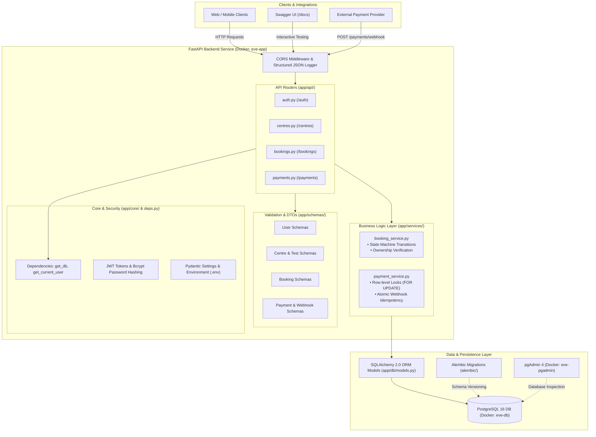
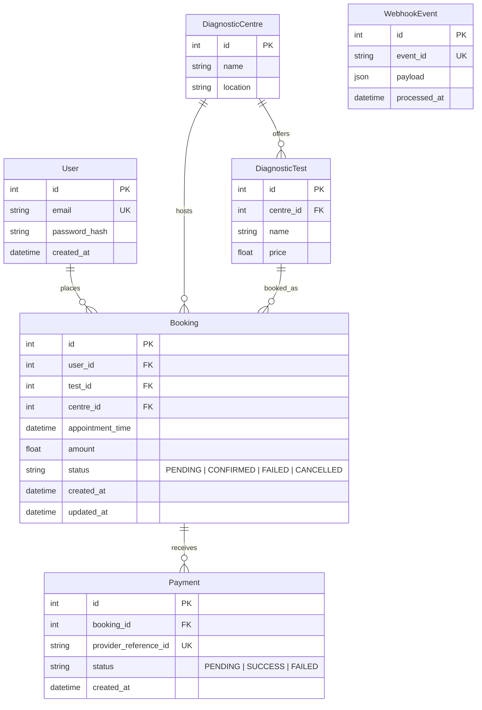

# EVE Healthcare — Diagnostic Test Booking & Payment Backend Service

Production-ready backend service for diagnostic test bookings and simulated payments with robust idempotency guarantees and concurrency control. Built with FastAPI, PostgreSQL, SQLAlchemy, Alembic, Docker, and `uv`.

---

## 1. Architecture & Design Highlights

- **Framework:** FastAPI (automatic OpenAPI/Swagger docs at `/docs`, Redoc at `/redoc`, strict Pydantic schemas)
- **Database & ORM:** PostgreSQL managed via SQLAlchemy 2.0 and Alembic migrations
- **Concurrency & Threading Model:** As synchronous drivers (`psycopg2-binary`) block the Python event loop, all database-touching route handlers are declared as standard `def` endpoints. FastAPI executes them in an internal threadpool, preventing event-loop starvation under high concurrency.
- **Payment Concurrency Protection:** On `POST /payments/`, the booking row is locked using `SELECT ... FOR UPDATE` (`with_for_update()`). Concurrent requests for the same booking are serialized; the second request sees the terminal status and is rejected with `409 Conflict`.
- **Webhook Idempotency Guarantee:**
  1. Payment provider passes a unique `event_id`.
  2. The service attempts an atomic insert into the `webhook_events` table (guarded by a unique index on `event_id`).
  3. If a duplicate `event_id` is detected, the transaction rolls back cleanly, and a `200 OK` is returned immediately with no state mutation.
  4. Non-existent booking references return `200 OK` (with warning logs) so payment provider webhook retry loops are not broken.
  5. Booking state transitions follow a strict one-way state machine (`PENDING -> CONFIRMED`, `PENDING -> FAILED`, `PENDING/CONFIRMED -> CANCELLED`). Out-of-order or stale webhooks result in safe no-ops without corrupting state or raising 500 errors.
- **Structured JSON Logging:** Structured JSON format containing timestamps, log levels, event names, and context metadata.

---

## 2. Codebase Architecture

The application is structured following a clean, layered architectural pattern that separates concerns across API presentation, business logic, data models, and persistence.

### Architectural Diagram



### Layered Architecture Responsibilities

1. **API Presentation Layer (`app/api/`):**
   - Implements RESTful HTTP routes using FastAPI `APIRouter`.
   - All DB-interacting routes are declared as standard `def` (instead of `async def`) so FastAPI delegates them to an internal threadpool, preventing blocking calls on the `psycopg2` driver from stalling the event loop.
   - Decoupled from direct database manipulations by calling into dedicated services.

2. **Business & Domain Logic Layer (`app/services/`):**
   - **`booking_service.py`:** Enforces business logic such as appointment slot validation, owner verification, and legal booking state machine transitions (`PENDING -> CONFIRMED`, `PENDING -> FAILED`, `PENDING/CONFIRMED -> CANCELLED`).
   - **`payment_service.py`:** Manages simulated payment execution, concurrency serialization via row-level locking (`with_for_update()`), and atomic idempotency checks on webhook delivery.

3. **Data Access & Persistence Layer (`app/db/` & `alembic/`):**
   - Declarative SQLAlchemy models mapping relational tables with strict foreign keys, cascade/restrict rules, and unique constraints.
   - Version-controlled schema migrations through Alembic scripts.

4. **Request/Response Validation Layer (`app/schemas/`):**
   - Strict Pydantic v2 schemas providing input validation, type coercion, and serializing responses.
   - Ensures malformed requests are rejected immediately with `422 Unprocessable Content`.

5. **Security & Configuration Layer (`app/core/`):**
   - Manages environment variables using `pydantic-settings`.
   - Direct `bcrypt` password hashing and constant-time verification.
   - Stateless JWT generation and validation via `python-jose`.

### Directory Structure

```
EVE/
├── app/
│   ├── main.py                     # Application entrypoint & lifespan events
│   ├── api/                        # HTTP route handlers
│   │   ├── deps.py                 # Dependency injection (get_db, get_current_user)
│   │   ├── auth.py                 # /auth/signup & /auth/login
│   │   ├── centres.py              # /centres & /centres/{id}/tests
│   │   ├── bookings.py             # /bookings CRUD & status updates
│   │   └── payments.py             # /payments simulation & /payments/webhook
│   ├── core/                       # Shared configuration & security utilities
│   │   ├── config.py               # Pydantic BaseSettings & env parsing
│   │   ├── security.py             # JWT token creation & bcrypt password hashing
│   │   └── logging.py              # Structured JSON application logger
│   ├── db/                         # Database connection & models
│   │   ├── base.py                 # SQLAlchemy engine, session maker & Base
│   │   ├── models.py               # Database entities (User, Booking, Payment, etc.)
│   │   └── seed.py                 # Seed script for initial diagnostic centres/tests
│   ├── schemas/                    # Pydantic validation & transfer models
│   │   ├── user.py                 # User signup & token models
│   │   ├── centre.py               # Diagnostic centre & test models
│   │   ├── booking.py              # Booking create & response models
│   │   └── payment.py              # Payment & webhook event models
│   └── services/                   # Encapsulated domain business logic
│       ├── booking_service.py      # Booking lifecycle & state-machine guards
│       └── payment_service.py      # Concurrency lock & webhook idempotency
├── alembic/                        # Database migration scripts
│   ├── versions/                   # Migration versions (001_initial_schema.py)
│   └── env.py                      # Alembic environment config
├── tests/                          # Automated pytest suite (32 tests)
│   ├── conftest.py                 # In-memory SQLite fixtures & TestClient setup
│   ├── test_auth.py                # Auth, JWT, and credential tests
│   ├── test_bookings.py            # Booking lifecycle & authorization tests
│   ├── test_payments.py            # Payment simulation & concurrency lock tests
│   └── test_webhook_idempotency.py # Webhook idempotency & deduplication tests
├── Dockerfile                      # Container build definition using uv
├── docker-compose.yml              # Multi-container stack (app, postgres, pgadmin)
├── pyproject.toml                  # Python package specifications & pytest config
├── uv.lock                         # Deterministic package lockfile
├── .env.example                    # Environment variable template
└── README.md                       # Comprehensive documentation & setup guide
```

---

## 3. Database Schema



### Booking State Machine
```
           ┌──────────────┐
           │   PENDING    │
           └──────┬───────┘
          /       │        \
  (pay/hook) (pay/hook)   (user cancel)
        /         │          \
       v          v           v
┌───────────┐ ┌─────────┐ ┌───────────┐
│ CONFIRMED │ │ FAILED  │ │ CANCELLED │
└─────┬─────┘ └─────────┘ └───────────┘
      │                          ^
      └────── (user cancel) ─────┘
```

---

## 4. Quickstart & Local Setup

### Prerequisites
- [uv](https://astral.sh/uv) (fast Python package manager)
- Docker & Docker Compose
- Python 3.12+ (managed automatically by `uv`)

> **Note on Dependencies:** Dependencies are managed via `uv` in `pyproject.toml` and `uv.lock` instead of `requirements.txt`. To synchronize dependencies, use `uv sync`.

### Option A: Run via Docker Compose (Recommended)
This runs PostgreSQL, the FastAPI service, and pgAdmin together:

```bash
docker compose up -d --build
```
- **FastAPI API & Docs:** http://localhost:8000/docs
- **ReDoc Documentation:** http://localhost:8000/redoc
- **pgAdmin 4 Web Console:** http://localhost:5050 (Credentials: `admin@admin.com` / `admin`)
- **Postgres Port:** `localhost:5432`

### Option B: Run Locally with `uv`

1. **Install dependencies:**
   ```bash
   uv sync
   ```

2. **Configure environment:**
   Copy `.env.example` to `.env`:
   ```bash
   cp .env.example .env
   ```

3. **Run database migrations:**
   ```bash
   uv run alembic upgrade head
   ```

4. **Seed initial diagnostic centres & tests:**
   ```bash
   uv run python -m app.db.seed
   ```

5. **Start server:**
   ```bash
   uv run uvicorn app.main:app --reload --port 8000
   ```

---

## 5. API Endpoints & Example Requests

### Authentication
#### Signup: `POST /auth/signup`
```bash
curl -X POST http://localhost:8000/auth/signup \
  -H "Content-Type: application/json" \
  -d '{"email": "patient@example.com", "password": "SecurePassword123"}'
```

#### Login: `POST /auth/login`
```bash
curl -X POST http://localhost:8000/auth/login \
  -H "Content-Type: application/json" \
  -d '{"email": "patient@example.com", "password": "SecurePassword123"}'
```
Response:
```json
{
  "access_token": "eyJhbGciOi...",
  "token_type": "bearer"
}
```

---

### Diagnostic Centres & Tests
#### List Centres: `GET /centres/?skip=0&limit=10`
```bash
curl -X GET http://localhost:8000/centres/
```

#### List Centre Tests: `GET /centres/{id}/tests`
```bash
curl -X GET http://localhost:8000/centres/1/tests
```

---

### Bookings
#### Create Booking: `POST /bookings/` (Auth required)
```bash
curl -X POST http://localhost:8000/bookings/ \
  -H "Authorization: Bearer <TOKEN>" \
  -H "Content-Type: application/json" \
  -d '{"test_id": 1, "appointment_time": "2026-10-01T10:00:00Z"}'
```

#### Get Booking: `GET /bookings/{id}` (Auth required, owner-only)
```bash
curl -X GET http://localhost:8000/bookings/1 \
  -H "Authorization: Bearer <TOKEN>"
```

#### List User Bookings: `GET /bookings/?skip=0&limit=20` (Auth required)
```bash
curl -X GET http://localhost:8000/bookings/ \
  -H "Authorization: Bearer <TOKEN>"
```

#### Cancel Booking: `DELETE /bookings/{id}` (Auth required, owner-only)
```bash
curl -X DELETE http://localhost:8000/bookings/1 \
  -H "Authorization: Bearer <TOKEN>"
```

---

### Payments & Webhook
#### Simulate Payment: `POST /payments/` (Auth required, concurrency-locked)
```bash
curl -X POST http://localhost:8000/payments/ \
  -H "Authorization: Bearer <TOKEN>" \
  -H "Content-Type: application/json" \
  -d '{"booking_id": 1, "simulate_status": "SUCCESS"}'
```

#### Provider Webhook: `POST /payments/webhook` (No auth required, idempotent)
```bash
curl -X POST http://localhost:8000/payments/webhook \
  -H "Content-Type: application/json" \
  -d '{
    "event_id": "evt_9876543210",
    "event_type": "payment.success",
    "data": {
      "booking_id": 1,
      "provider_reference_id": "pay_external_123",
      "status": "SUCCESS",
      "amount": 450.0
    }
  }'
```

---

## 6. Running Tests

Tests use an isolated in-memory SQLite database and test client. All 32+ unit, integration, concurrency, and idempotency tests run via `pytest`:

```bash
uv run pytest -v
```

### Test Coverage Highlights:
- **Authentication:** Signup, duplicate email rejection (400), schema validation (422), login verification, wrong password rejection (401), token validation.
- **Bookings Lifecycle:** Centre listing, test lookup, 404 on missing centres/tests, booking creation, past-time rejection (422), owner authorization (403 forbidden for non-owners), booking cancellation, repeated cancellation idempotency.
- **Payment Concurrency:** Row-level locking via `with_for_update()`; simultaneous parallel payment attempts result in exactly 1 success (201) and 1 conflict rejection (409).
- **Webhook Idempotency:** Duplicate `event_id` delivery returns 200 without creating duplicate payments or re-transitioning states; unknown booking reference returns 200 gracefully; malformed payload returns 400.

---

## 7. Assumptions Made
1. **Mock Payment Outcome:** `/payments/` defaults to simulating a `SUCCESS` outcome. For test predictability, an optional `simulate_status` parameter (`SUCCESS` or `FAILED`) can be passed.
2. **Webhook Event ID:** `event_id` is generated by the payment provider and is guaranteed to be globally unique per payment attempt.
3. **Single Currency:** Prices and amounts are handled in a single currency (INR) without multi-currency exchange rates.
4. **Appointment Slotting:** Appointment times are validated to be strictly in the future.

---

## 8. What I Would Improve with More Time
1. **Redis Caching:** Cache diagnostic centre and test catalogs with TTL-based expiration and cache invalidation on updates.
2. **Asynchronous Webhook Processing via Celery/RabbitMQ:** Push incoming webhook events to a high-throughput message queue (returning 202 Accepted immediately) and process payment updates asynchronously with background workers.
3. **Rate Limiting:** Implement sliding-window rate limiting on `/auth/login` and `/payments/` using Redis token-bucket algorithm to prevent brute-force attacks and payment flooding.
4. **Time Slot Capacity Management:** Enforce appointment slot quotas per centre/technician to prevent overlapping appointments.
